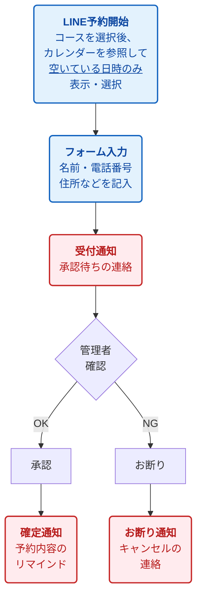

# 予約システムの流れとコスト

## フロー図

## ポイント
**★ カレンダー自動照合**
LINEで日時を選ぶ際、システムが自動でGoogleカレンダーの空き状況を確認するため、**「空いている時間」だけが選択肢として表示されます。** これによりダブルブッキングを防げます。

## テキスト版フロー

**【ステップ1】 ユーザーの操作 (無料)**
1. **LINE**
   コース選択後、カレンダーを参照して**空いている日時のみ**を表示・選択
   ↓
2. **フォーム**
   フォーム上で名前や電話・住所を記入

**【ステップ2】 通知と確認 (有料)**
3. **通知**
   受付完了（承認を待つよう通知）
   ↓
4. **確認**
   管理者が内容を確認

**【ステップ3】 結果の連絡 (有料)**
- **承認の場合**: 予約確定の連絡（双方に予約内容リマインド）
- **お断りの場合**: お断りの連絡
